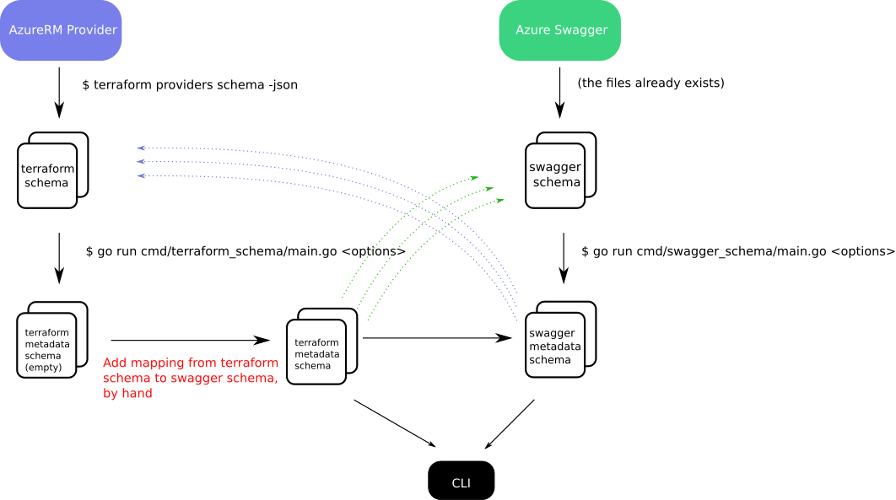

  
  
  

# Terraform AzureRM Provider Insight

A tool to map the underlying Azure API Swagger schema to the resource schema of Terraform AzureRM provider.

## How Does It Works

The overview workflow is illustrated below:

For a certain point (i.e. some release) of the provider, we generate the Terraform schema from it. In the meantime, we checkout the corresponding version of the [azure-rest-api-spec](https://github.com/Azure/azure-rest-api-specs) (the version is determined by the Azure Go SDK).

From the raw Terraform schema files, we will generate the Terraform metadata schemas. The generated files contain the **flattend** schemas, where all the (list/set of) [blocks](https://www.terraform.io/docs/configuration/syntax.html#blocks) will be expanded.

Next step is to manually add the mapping information from Terraform resource schema properties to the underlying Azure API Swagger schema properties into the generated Terraform metadata schema.

> 💡 The reason why we choose to maintain the mapping from Terraform to Swagger is that it is more intuitive and operational (by reading the provider code). As there is no way to tell the mapping the other way around.

Now we can generate the Swagger metadata schema by refering to both the Terraform metadata schema and the Swagger specs, which holds the mapping information from Swagger schema properties towards Terraform resource schema properties.

Based on the Terraform and Swagger metadata schema, we can have full grasp of the mappings from both directions, which is useful to proactively detect missed features in Terraform.

## Maintainance

Since both the Terraform provider and the Swagger spec are evolving all the time, the mapping between them might not be true as time goes by. This requires us to version control these mappings.

In this repo, we only maintain the Terraform metadata schemas for a certain Terraform provider version. When the provider version get updated, we will need a way to rebase the existing metadata schemas to the updated ones. In the rebase process, there might be conflicts (e.g. schema property is renamed/removed), which should be resolved manually. Similarly, the Swagger submodule should also be updated to the commit used to generate the Azure Go SDK, which is used by current version of provider.
